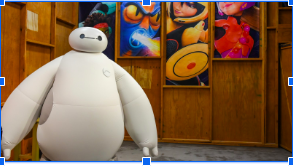
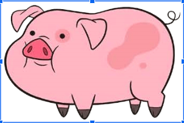
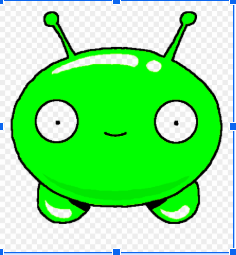

# Cuteness in Robots

*Performing Robots Presentation. October 31, 2019

##### Characteristics of my Robot
* Relatable
* Pure
* Innocent
* Naive
* Human
* Childish
* Dogish 

##### How to Design a Cute Robot
* The elements of Cute Character Design by Sasha Preuss
* <https://design.tutsplus.com/articles/the-elements-of-cute-character-design--vector-3533>

##### Behaviour of the Robot
* "Wall-E Reflection: When Robots are Human and Human are Robots."
* <https://sites.duke.edu/ambiguouslyhuman/2016/03/09/wall-e-reflection>
* Takeaways:
 1. Human in the movie have a methodical predictable behaviour, while robots are more spontaneous.
 2. In the  Human-Object Spectrum, Robots are closer human, Human are closer to objects. 
 3. Robots are relatable cause they develop their own personality.

##### Similarities of Cuteness: Robots vs Dogs
* The Science of Cute: How cuteness make us love our dog.
* <https://www.rover.com/blog/science-cute-dogs/>

 

 

