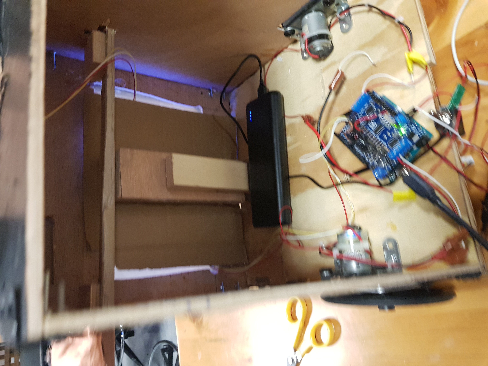
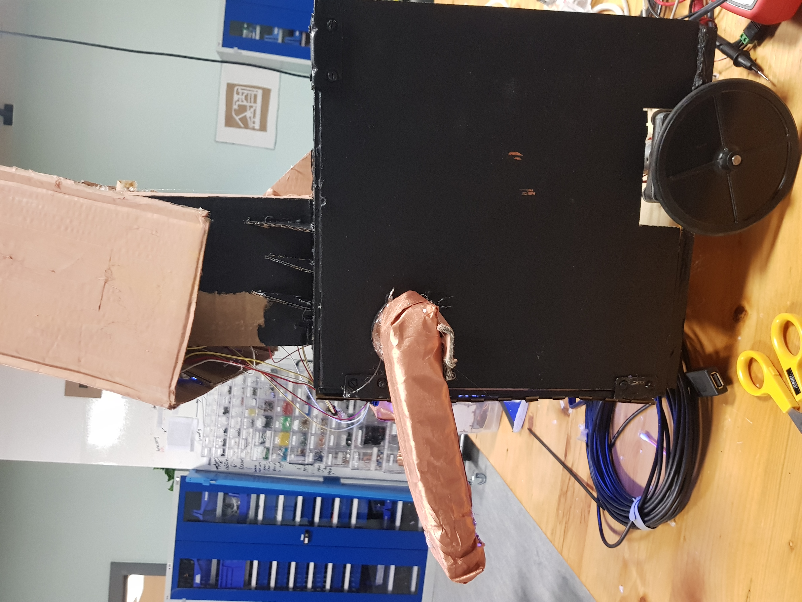
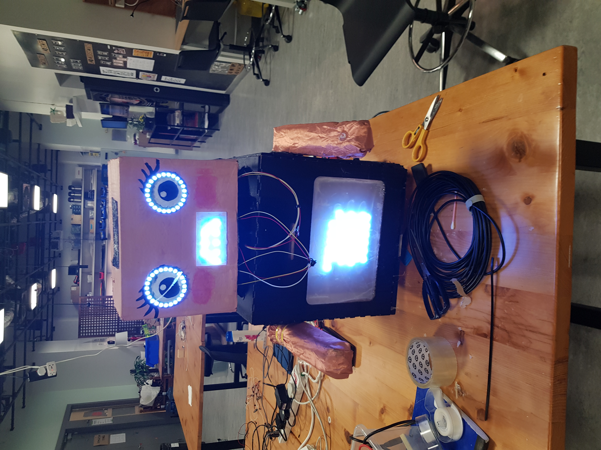
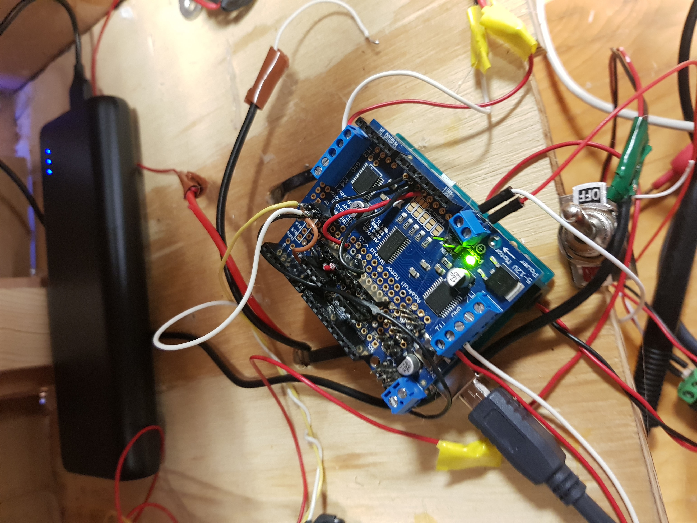
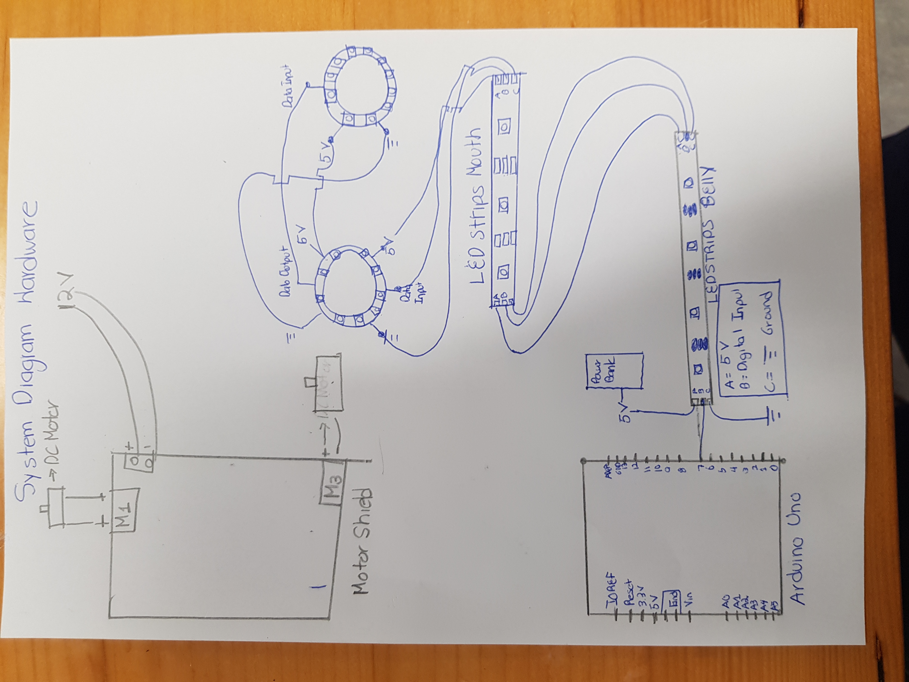

# Final Project: Sammy

### Concept and Description of the Performance

Sammy intended to be a performance that explores human relationships with Robots. Through a short story, this performance 
attempts to make the public care about Sammy( a robot) as if it was alive and feel that its relationships with the human characters are genuine. The short story consists of three characters(Sammy,Sammy's friend, and Sammy's romantic interest) and is dividedthree acts. In the first act, using the song "You've got in friend in me" from Toy story in the background, the relationship between Sammy and Sammy's friend is established through showing both characters happily playing a game together. I found effective using Toy Story's song because Toy Story is one of the most famous stories that succesfully explores human attachment with objects and itwill create a nostalgic sensation in the public of a time when they develop attachment to a particular object.In the second act, Sammy shows his spontaneity, desires and personality. Sammy falls in love at first sight and  tryto flirt with its romantic interest in a  naive and adorkable way. Sammy asks help from his friend to approach its
romantic interest and its frie  provide with objects that Sammy then brings to its Romantic Interest, hoping this 
causes a good impression. In the third act, Sammy shows that it is in conflic with itself. After some rejections, 
Sammy's Romantic Interest finally agrees to go out with him, but that means that he has to stop spending time with his friend. 
This causes that when Sammy is about to leave with its Romantic Interest, Sammy looks back at his friend. And that glance Sammyand Sammy's friend share is opened to interpretation of the public. 

This performance beyond exploring human attachment also attempt to answer the question "what make us humans?". Sammy, in essence, is only cables,wood, code, electricity, super glue, etc. So, is it possible that the public perceive him as alive?. If public can relate with Sammy and care about it, it is a sign that Sammy is perceived as alive. The strategy used to create this perceptio is that the animations and movement of Sammy are intended to portrayed desire, attachment, conflict and vulnerability. Which are intrinsic attributes of human beings. 

### Description of Sammy
Sammy have two main attributes. It can move and it can show animations. Animations are made through two panels(its belly and mouth)
made with LED strips and two Neopixel Rings(Eyes). The movement is made with two DC motors capable to move, Up, Down, Left, and Right.
Sammy building process was divided in three stages. Stage 1 consisted of building the base out of wood and two the DC Motors and wheels. 
Stage 2 consisted of builidng the body and the arms. Body was made out of wood and it has the shape of a Cube with 30 X 30 cm dimensions
In the center of one of the faces an LED stips Panel was added and in other two faces,a plastic arm was also added. In the third Stage,
a carboard head was added at the top of the body cube. Two neopixels and another LED strip Panel was added to simulate eyes and mouth. 


### Overall Pictures 
##### Stage 1
*
*
*
##### Stage 2
*
*
##### Stage 3
*![Head] (PuttingHead.jpg)
*![Head] (Head.jpg)
##### Sammy Finshed
*


### Important Parts
* 2 DC Motors
* 2 Wheels
* LED Strips
* 2 Neopixel Rings
* Motor Shield
* Arduino Uno

### Pictures of the Electronics
*


### System Diagram Hardware
*


### Code
##### Arduino 
```bash
      //Neoppixels
      #include <Adafruit_NeoPixel.h>
      #ifdef __AVR__
       #include <avr/power.h> // Required for 16 MHz Adafruit Trinket
      #endif
      
      #define NUMPIXELS 179
      //#define EYEPIXELS 24
      #define LED_PIN 5
      
      //color Red = Color(255,51,51);
      Adafruit_NeoPixel pixels (NUMPIXELS, LED_PIN, NEO_GRB + NEO_KHZ800);
      
      //Adafruit_NeoPixel eye (EYEPIXELS, LED_PIN, NEO_GRB + NEO_KHZ800);
      
      #define DELAYAL 500 // Time (in milliseconds) to pause between pixels
      
      // Declare our NeoPixel strip object:
      //Adafruit_NeoPixel strip(LED_COUNT, LED_PIN, NEO_GRB + NEO_KHZ800);
      //Neopixels done
      
      #include <Adafruit_MotorShield.h>
      #include <Wire.h>
      
      Adafruit_MotorShield AFMS = Adafruit_MotorShield();
      Adafruit_DCMotor *LeftMotor = AFMS.getMotor(1);
      Adafruit_DCMotor *RightMotor = AFMS.getMotor(3);
      char val; // Data received from the serial port
      
      
   void setup(){
        Serial.begin(9600);  // Begin the serial monitor at 9600bps
        Serial.println("Adafruit Motorshield v2 - DC Motor test!");
        AFMS.begin();
        LeftMotor->setSpeed(150);
        LeftMotor->run(FORWARD);
        LeftMotor->run(RELEASE);
        RightMotor->setSpeed(150);
        RightMotor->run(FORWARD);
        RightMotor->run(RELEASE);
      
        //Neopixels Setup
        pixels.clear();
        pixels.begin();
        pixels.setBrightness(50);
      }
      
      
   void loop(){
        if(Serial.available() >0){ // If I am receiving values from Processing
        char input = Serial.read(); // Read values from Processing
          Serial.println(input);
          if (input == 'f') { // Move Forward
            Serial.println("Hello");
            LeftMotor->run(FORWARD);
            LeftMotor->setSpeed(150);
            RightMotor->run(BACKWARD); //power and ground are opposite thats why it is the opposite direction
            RightMotor->setSpeed(150);
            Normal_Animation(); // Display default animation 
          }
          else if (input == 'l') { // Move to the Left
            LeftMotor->run(BACKWARD);
            LeftMotor->setSpeed(150);
            RightMotor->run(BACKWARD);
            RightMotor->setSpeed(150); 
            Normal_Animation();// Display default animation 
          }
          else if (input == 'r') {
            LeftMotor->run(FORWARD);
            LeftMotor->setSpeed(150);
            RightMotor->run(FORWARD);
            RightMotor->setSpeed(150);
            Normal_Animation(); // Display default animation
          }
          else if (input == 'b') {
            LeftMotor->run(BACKWARD);
            LeftMotor->setSpeed(150);
            RightMotor->run(FORWARD); //power and ground are opposite thats why it is the opposite direction
            RightMotor->setSpeed(150);
            Normal_Animation();// Display default animation
          }
          else if(input == 'h'){ // Display In love Animation 
             inLove_Animation();
          }
          else if(input == 'n'){ // Display default Animation 
            Normal_Animation();
          }
          else if(input == 'e'){ // Display Excited Aniamtion 
            Excited_Animation();
          }
          else if(input == 's'){ // Display Sad Animation 
            Sad_Animation();
          }
        }
        }
      
      void eyes(){
        for(int i = 131;i<180;i++){
           pixels.setPixelColor(i, pixels.Color(102, 178,255)); // Display Neopixel Rings
          }
      }
      
      
      void heart(){ // Draw a heart
         pixels.clear();
         pixels.setPixelColor(107, pixels.Color(102, 178,255)); 
         pixels.setPixelColor(85, pixels.Color(102, 178,255)); 
         pixels.setPixelColor(79, pixels.Color(102, 178,255));
         pixels.setPixelColor(58, pixels.Color(102, 178,255));
         pixels.setPixelColor(50, pixels.Color(102, 178,255));
         pixels.setPixelColor(31, pixels.Color(102, 178,255));
         pixels.setPixelColor(21, pixels.Color(102, 178,255));
         pixels.setPixelColor(6, pixels.Color(102, 178,255));
         
         pixels.setPixelColor(8, pixels.Color(102, 178,255));
         pixels.setPixelColor(17, pixels.Color(102, 178,255));
         pixels.setPixelColor(36, pixels.Color(102, 178,255));
         pixels.setPixelColor(44, pixels.Color(102, 178,255));
         pixels.setPixelColor(65, pixels.Color(102, 178,255));
         pixels.setPixelColor(71, pixels.Color(102, 178,255));
         pixels.setPixelColor(94, pixels.Color(102, 178,255));
         pixels.setPixelColor(94, pixels.Color(102, 178,255));
         pixels.setPixelColor(99, pixels.Color(102, 178,255));
         pixels.setPixelColor(103, pixels.Color(102, 178,255));
         
         pixels.setPixelColor(7, pixels.Color(255, 0,0)); 
         
         pixels.setPixelColor(21-1, pixels.Color(255, 0,0)); 
         pixels.setPixelColor(20-1, pixels.Color(255, 0,0)); 
         pixels.setPixelColor(19-1, pixels.Color(255, 0,0));
       
         pixels.setPixelColor(33-1, pixels.Color(255, 0,0));
         pixels.setPixelColor(34-1, pixels.Color(255, 0,0)); 
         pixels.setPixelColor(35-1, pixels.Color(255, 0,0));
         pixels.setPixelColor(36-1, pixels.Color(255, 0,0)); 
         
         pixels.setPixelColor(50-1, pixels.Color(255, 0,0));
         pixels.setPixelColor(49-1, pixels.Color(255, 0,0));
         pixels.setPixelColor(48-1, pixels.Color(255, 0,0));
         pixels.setPixelColor(47-1, pixels.Color(255, 0,0));
         pixels.setPixelColor(46-1, pixels.Color(255, 0,0));
      
         pixels.setPixelColor(60-1, pixels.Color(255, 0,0));
         pixels.setPixelColor(61-1, pixels.Color(255, 0,0));
         pixels.setPixelColor(62-1, pixels.Color(255, 0,0));
         pixels.setPixelColor(63-1, pixels.Color(255, 0,0));
         pixels.setPixelColor(64-1, pixels.Color(255, 0,0));
         pixels.setPixelColor(65-1, pixels.Color(255, 0,0));
        
         pixels.setPixelColor(79-1, pixels.Color(255, 0,0));
         pixels.setPixelColor(78-1, pixels.Color(255, 0,0));
         pixels.setPixelColor(77-1, pixels.Color(255, 0,0));
         pixels.setPixelColor(76-1, pixels.Color(255, 0,0));
         pixels.setPixelColor(75-1, pixels.Color(255, 0,0));
         pixels.setPixelColor(74-1, pixels.Color(255, 0,0));
         pixels.setPixelColor(73-1, pixels.Color(255, 0,0));
         
         pixels.setPixelColor(87-1, pixels.Color(255, 0,0));
         pixels.setPixelColor(88-1, pixels.Color(255, 0,0));
         pixels.setPixelColor(89-1, pixels.Color(255, 0,0));
         pixels.setPixelColor(90-1, pixels.Color(255, 0,0));
         pixels.setPixelColor(91-1, pixels.Color(255, 0,0));
         pixels.setPixelColor(92-1, pixels.Color(255, 0,0));
         pixels.setPixelColor(93-1, pixels.Color(255, 0,0));
         pixels.setPixelColor(94-1, pixels.Color(255, 0,0));
      
         pixels.setPixelColor(107-1, pixels.Color(255, 0,0));
         pixels.setPixelColor(106-1, pixels.Color(255, 0,0));
         pixels.setPixelColor(105-1, pixels.Color(255, 0,0));
         pixels.setPixelColor(103-1, pixels.Color(255, 0,0));
         pixels.setPixelColor(102-1, pixels.Color(255, 0,0));
         pixels.setPixelColor(101-1, pixels.Color(255, 0,0));
         
        }
      
        void happy_face(){  // Draw a happy face 
          pixels.setPixelColor(112, pixels.Color(102, 178,255));
          pixels.setPixelColor(116, pixels.Color(102, 178,255));
      
          pixels.setPixelColor(122, pixels.Color(102, 178,255));
          pixels.setPixelColor(119, pixels.Color(102, 178,255));
      
          pixels.setPixelColor(127, pixels.Color(102, 178,255));
          pixels.setPixelColor(128, pixels.Color(102, 178,255));
          pixels.setPixelColor(129, pixels.Color(102, 178,255)); 
        }
      
        void sad_face(){ // Draw a sad face
          pixels.setPixelColor(113-1, pixels.Color(102, 178,255));
          pixels.setPixelColor(114-1, pixels.Color(102, 178,255));
          pixels.setPixelColor(115-1, pixels.Color(102, 178,255));
      
          pixels.setPixelColor(122-1, pixels.Color(102, 178,255));
          pixels.setPixelColor(119-1, pixels.Color(102, 178,255));
      
          pixels.setPixelColor(126-1, pixels.Color(102, 178,255));
          pixels.setPixelColor(130-1, pixels.Color(102, 178,255));
        }
      
        void Heartbreak(){ // Display a heartbroken
          for(int i = 0;i<111;i++){
            if( i!=21-1||i!=19-1 ||i!=33-1 ||i!=34-1|| i!=36-1 || i!=50 -1|| i!=49-1
             ||i!=47-1 ||i!=46 -1||i!=60 -1||i!=61 -1||i!=62 -1 ||i!=64-1 ||i!=65 -1||i!=79-1 ||
            i!=78-1  ||i!=75-1 ||i!=74-1 ||i!=87 -1||i!=88-1 ||i!=89-1 ||i!=90-1||
            i!=92-1 ||i!=93 -1||i!=94-1 ||i!=107-1 ||i!=106-1 ||i!=105-1 ||i!=103-1 ||i!=102 -1||i!=101-1)
            pixels.setPixelColor(i, pixels.Color(102, 178,255)); 
         
        }
      
        
          //pixels.setPixelColor(7, pixels.Color(255, 0,0)); 
         
          pixels.setPixelColor(21-1, pixels.Color(255, 0,0)); 
          //pixels.setPixelColor(20, pixels.Color(255, 0,0)); 
          pixels.setPixelColor(19-1, pixels.Color(255, 0,0));
       
          pixels.setPixelColor(33-1, pixels.Color(255, 0,0));
          pixels.setPixelColor(34-1, pixels.Color(255, 0,0)); 
          //pixels.setPixelColor(35, pixels.Color(255, 0,0));
          pixels.setPixelColor(36-1, pixels.Color(255, 0,0)); 
         
           pixels.setPixelColor(50-1, pixels.Color(255, 0,0));
           pixels.setPixelColor(49-1, pixels.Color(255, 0,0));
           //pixels.setPixelColor(48, pixels.Color(255, 0,0));
           pixels.setPixelColor(47-1, pixels.Color(255, 0,0));
           pixels.setPixelColor(46-1, pixels.Color(255, 0,0));
        
           pixels.setPixelColor(60-1, pixels.Color(255, 0,0));
           pixels.setPixelColor(61-1, pixels.Color(255, 0,0));
           pixels.setPixelColor(62-1, pixels.Color(255, 0,0));
           //pixels.setPixelColor(63, pixels.Color(255, 0,0));
           pixels.setPixelColor(64-1, pixels.Color(255, 0,0));
           pixels.setPixelColor(65-1, pixels.Color(255, 0,0));
          
           pixels.setPixelColor(79-1, pixels.Color(255, 0,0));
           pixels.setPixelColor(78-1, pixels.Color(255, 0,0));
           pixels.setPixelColor(77-1, pixels.Color(255, 0,0));
           //pixels.setPixelColor(76, pixels.Color(255, 0,0));
           pixels.setPixelColor(75-1, pixels.Color(255, 0,0));
           pixels.setPixelColor(74-1, pixels.Color(255, 0,0));
           pixels.setPixelColor(73-1, pixels.Color(255, 0,0));
           
           pixels.setPixelColor(87-1, pixels.Color(255, 0,0));
           pixels.setPixelColor(88-1, pixels.Color(255, 0,0));
           pixels.setPixelColor(89-1, pixels.Color(255, 0,0));
           pixels.setPixelColor(90-1, pixels.Color(255, 0,0));
           //pixels.setPixelColor(91, pixels.Color(255, 0,0));
           pixels.setPixelColor(92-1, pixels.Color(255, 0,0));
           pixels.setPixelColor(93-1, pixels.Color(255, 0,0));
           pixels.setPixelColor(94-1, pixels.Color(255, 0,0));
        
           pixels.setPixelColor(107-1, pixels.Color(255, 0,0));
           pixels.setPixelColor(106-1, pixels.Color(255, 0,0));
           pixels.setPixelColor(105-1, pixels.Color(255, 0,0));
           pixels.setPixelColor(103-1, pixels.Color(255, 0,0));
           pixels.setPixelColor(102-1, pixels.Color(255, 0,0));
           pixels.setPixelColor(101-1, pixels.Color(255, 0,0));
          }
      
        void Normal_Animation(){ // Functions that coordinates the normal Animation
          pixels.clear();
          for(int i = 0;i<111;i++){
            pixels.setPixelColor(i, pixels.Color(102, 178,255)); 
          }
          happy_face();
          eyes();  
          pixels.show();
        }
      
      
        void Sad_Animation(){ // Function that coordinates Sad Animation
          pixels.clear();
          sad_face();
          Heartbreak();
          eyes();
          pixels.show();
          
        }
      
        void inLove_Animation(){ // Functino that coordinates InLove Animation 
          pixels.clear();
          heart();
          happy_face();
          eyes();
          pixels.show();
        }
      
       void Excited_Animation(){ // Funcitino that Coordinates Excited_Animation
          pixels.clear();
          exciting();
          pixels.show();
         }
      
      void exciting(){ // Belly display when it is excited
        char reading ='e';
        for(int i =0 ; i<pixels.numPixels();i++){
          reading = Serial.read();
          pixels.setPixelColor(i, pixels.Color(255, 153,255));
       
          }
        }
        
  ```
  ##### Processing
  ##### Processing Main Code
  ``` Java
  import processing.serial.*;

Serial myPort;  // Create object from Serial class
char val;        // Data received from the serial port
Button HeartBeat; 
Button Excited;
Button Normal;
Button Sad; 
boolean IsHeartBeat;
boolean IsExcited;
boolean IsNormal;
boolean IsSad;

void setup() 
{ 
  size(640, 480);
  val = 'n';//val will be send to arduino
  HeartBeat = new Button("HeartBeat",'h', width/10, height/10, width/10, height/10); // create buttons
  Excited = new Button("Excited",'e', width*.8, height/10, width/10, height/10);
  Normal = new Button("Normal", 'n', width/10, height*.8, width/10, height/10);
  Sad = new Button("Sad", 's', width*.8, height*.8, width/10, height/10);
  IsHeartBeat = false;
  IsExcited = false;
  IsNormal = false;
  IsSad = false;
  // I know that the first port in the serial list on my mac
  // is always my  FTDI adaptor, so I open Serial.list()[0].
  // On Windows machines, this generally opens COM1.
  // Open whatever port is the one you're using.
  // printArray(Serial.list());
   String portName = Serial.list()[6]; // get the name of the port
   println(portName);
   myPort = new Serial(this, portName, 9600); // create a port 
}

void draw() {
  background(0);
  //Check if any of the keys are being pressed
  keyPressed(); 
  //display buttons and check if they are being pressed 
  HeartBeat.display();
  IsHeartBeat = HeartBeat.mouseClicked(); 
  Excited.display();
  IsExcited = Excited.mouseClicked();
  Normal.display();
  IsNormal = Normal.mouseClicked();
  Sad.display();
  IsSad = Sad.mouseClicked();
  
  // Changing the instruction that processing will send
  if(IsHeartBeat == true){
    val = 'h'; 
  }
  else if(IsExcited == true){
    val = 'e';
  }
  
  else if(IsNormal == true){
    val = 'n';
  }
  
  else if(IsSad == true){
    val = 's';
  }
  
  println(val);
  //Send the value to arduino
  myPort.write(val);
}

//Check if any of the keys is being pressed. 
void keyPressed(){
  if(keyCode == LEFT){
    val = 'l';
  }
  else if(keyCode == UP){
    val = 'f';
  }
  else if(keyCode == RIGHT){
    val = 'r';
  }
   else if(keyCode == DOWN){
     val = 'b';
   }
}
``` 

##### Processing classes 
``` bash
// Buttons to send commands to arduino
class Button{
  String Command;
  float x, y, w,h;
  char toArduino;
  
  Button(String command, char toarduino, float X, float Y, float W, float H){
    Command = command;
    toArduino = toarduino;
    x = X;
    y = Y; 
    w = W;
    h = H;
  }
  


    
 
  
  void display(){  
    //display a hoverif  I am on the button 
   if(mouseX>x && mouseX<x+w && mouseY>y && mouseY<y+h){
      //print("I am");
      pushStyle();
      stroke(178,255,202);
      fill(255,104,204);
      rect(x,y,w,h);
      popStyle();
      text(Command,x,y,w,h);
     // popStyle(); 
    }
    
    else{
    //displat button 
    pushStyle();
    noStroke();
    fill(255,104,204);
    rect(x,y,w,h);
    popStyle();
    text(Command,x,y,w,h);
  }
  
  }
  
  boolean mouseClicked(){
    //check if the button is being pressed
    if(mouseX>x && mouseX<x+w && mouseY>y && mouseY<y+h&& mousePressed){
      return true; 
  }
  else{
    return false;
  }
 
}

}
```

### Problems Discussion
##### Problem 1: Connecting to Bluetooth
As I knew I needed several animations and movements, I thought it may have been useful to make my own control panel in Processing and control the robot from my computer through bluetooth comunnication. Just connecting once to bluetooth end up being a hassle that took me a whole weekend. The reason why I couldn't connect was that I was not running the processing script properly that connects to the bluetooth port. At the end, I decided to drop this bluetooth communciation due to the lack of reliability. My computer only connected properly 1 out of 2 times, so I considered it was not reliable enought to performed. Hence, I decided to get a usb extension cable and keep the translation movement of the robot in shor distances. 

##### Problem 2: Connecting Everything 
I was intimadated with this issue since the beginning of the project. There were so many possibilities to connect all my components and all of them seemed tedious and complicated. First, I did an attempt to connect everything using redboards. I decided to do this because I feel comfortable working with breadboards. The outcome was a horrific mess of cablesm, although apparently everything seemed to work succesfully, It was not convenient to leave that mess of cables in case there was the need to fix something. My second attempt was adding an arduino shape shield on top of the motorshield. So I decided to solder everything again and due to my lack of organization I ended up again with a mess of cables that this time it was not working at all. So, I solder everything again in my motorshield and this time things were working alright, althouhgh it was not as clean as I wanted. 

Regarding the logistics of networking everything, My professor showed me how to do Hardware diagrams that helpmed to have a cleared picture of the different ways I was to able to connect the different compenents with the Arduino Pins. 

At the end, I feel that I learned several techniques to keed organized and clear the connections when I am working with many different components.

##### Problem 3: LED Strips Soldering 
This was the most frustating issue of all and I still do not have a better explanation rather than I am really bad at soldering. No matter how many times I solder and resolder and solder again all my LED Strips connections there was always an issue that did not allow my LED Strips work succesfully every time. Sometimes they worked perfectly the way I wanted, sometimes they suddenly stopped working out of nowhere. I spend more than a whole day just working with this issue. At the end, It turned out that also my powerbank did not have enough power to all the LEDs I was using, so when I decreased the brightness the LED strips ended up working better, although I still often had to solder again some connections among LED strips. 

##### Problem 4: Not working efficiently
The amount of of time I dedicated  trying to build this robot was incredible huge. Just in the one weekend I worked for 20 hours in the robot and all the progress I did was making the Servos working. I spend two days just making the LED strips woks, I spend two days making the bluetooth connects. At the end I am definitely sure I dedicated more than one houndred hours to this robot and I still was not able to make it work properly. My issues were that I did not have a concrete whole plan, I was figuring it out things in the way. I spent so much time debugging and trying to find a mistake that it was really obvious. I think the main reason why I dedicated so much time withouth significant progress is that I was not confident enough in my engineering skills and every single step in the building process of the robot was also a signigicant emotianal struggle. I feel what could have solved my problem would have been teaming up with someone. Just having someone else would created a emotional support that would have made me so much efficient to work. But, I also think that this is a superficial solution to the issue, becuase I can not always depend on having partner to being more efficient. So, my guess is that there many things that I have to improve as a person in order to improve my efficiently. One of the first one that came into my mind is communication. I should have communicated the emotional hassle that building the robot was being. Yet, I also think this is one of the solutions that are easy to say but hard to do. I feel that the I still should a further analysis in order to have a a more accurate reading of my performance during this project.


      
      
      
      
      
        


  


