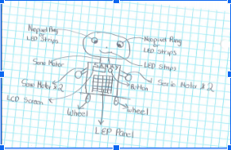

# S.A.M.M.Y 
##### Performing Robots Fall 2019
##Who is S.A.M.M.Y?
*S.A.M.M.Y is a performative Robot able to simulate the human emotion of falling in Love.
* At first impression, S.A.M.M.Y will pretend to be an interactive music Robot. But when a person touches his heart, 
he will recreate an exaggerated behaviour of a  person falling in love for someone.
* S.A.M.M.Y will be able to ask that person for a dance and dance a romantic ballad. 

## S.A.M.M.Y ATTRIBUTES
1. Interactive LED eyes and mouth: To simulate human gestures associated to the emotion that is being portrayed. 
2. Red Button: To simulate the human, this will be touched by the person with whom S.A.M.M.Y will fall in love
3. Interactive LED panel: This panel will react to the sound that is around it, to simulate that S.A.M.M.Y is a music interactive robot
and not with the purpose of falling in love. 
4. LCD Screen: To print the what S.A.M.M.Y wants to say. 
5. Controllable Arms,  Legs and Neck:  The movement of the legs and robot will be able to be control from the a remote control. (Maybe using processing)

## S.A.M.M.Y DESIGN 

## Materials
* 5 Servo Motors (Arms and Neck)
* LED Strips
* Sound Sensor
* 2 DC Motor
* 2 Neopixel Rings
* LCD Screen 
* 3 Arduinos UNO
* 2 motor shields

## Performance Structure
* S.A.M.M.Y will pretend to be an installation and he will be in Music State.
* People will come to see how S.A.M.M.Y interact with music. 
* A random Person(Or an actor/actress) will touch the red button and S.A.M.M.Y  will get into IN Love State. 
* LED panel and Eyes will go crazy and he will wumble.
* The LCD Panel will print a message inviting the person for a dance.
* S.A.M.M.Y will dance with the person or actor/actress.

## Why I think we Should do this Performance
* IT EXPLORES HUMAN BEHAVIOUR IN A FUTURISTIC POTENTIAL SITUATION.
* IT EXPLORES THE HUMAN HEART IN CONFLICT WITH ITSELF.
* FROM A REALISTIC PERSPECTIVE, IT IS A CRITIQUE TO A HUMAN VICE.
* FROM AN IDEALISTIC PERSPECTIVE, IT CONVEYS THE MESSAGE THAT THERE IS SOME KIND OF MAGIC IN LOVE BEYOND OUR UNDERSTANDING.

